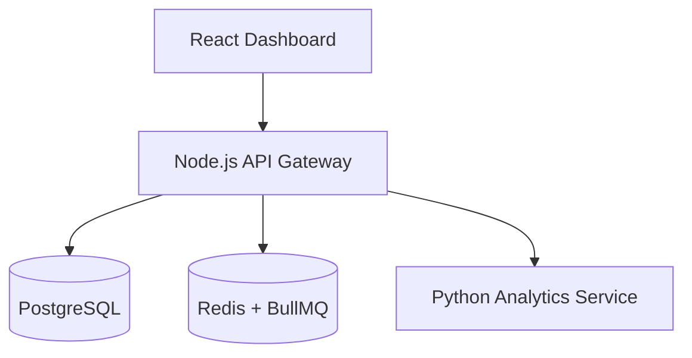

# Vero

**Financial intelligence that turns data into decisions**

## What this is

Vero is a financial intelligence platform that analyzes transaction data to surface insights, risks, and trends that help users make better financial decisions.

It focuses on interpretation, not just visualization.


## The problem

Most financial tools either:

* show raw data without context
* or require expertise to extract meaningful insights

As a result, users react to numbers instead of understanding them.


## The approach

Vero turns financial data into actionable insights by:

* analyzing transaction patterns
* detecting anomalies and risks
* highlighting trends in income, spending, and cash flow

The goal is simple:

> help users understand what is happening and what to do next


## Example insight

"Your spending increased 18% this month, driven mostly by weekend dining. At this rate, you will exceed your monthly budget in 10 days."


## Demo

Coming soon

## Design philosophy

This project is influenced by a product-first mindset:

- Clarity over complexity
- Insights over raw data
- Usability over feature bloat

Every feature is evaluated based on one question:

Does this help the user make a better financial decision?

## Current capabilities

* Transaction ingestion and storage
* Account and balance tracking
* Cash flow and spending analysis
* Basic insight endpoints (anomalies, subscriptions, health)


## Planned features

* Real-time transaction ingestion
* ML-based categorization
* Alerting and notifications
* Multi-currency support
* Advanced financial planning tools


## Architecture

Modular system with separated services:

* React frontend dashboard
* Node.js API gateway
* Python analytics service
* PostgreSQL database
* Redis for caching and background jobs




## Tech stack

* Frontend: React + TypeScript + Vite
* Backend: Node.js + Express
* Analytics: Python + FastAPI
* Database: PostgreSQL
* Queue: Redis + BullMQ
* Infra: Docker


## Quickstart

Run everything with Docker:

```bash
docker-compose up --build
```

Services:

* Frontend: http://localhost:5173
* API: http://localhost:4000
* Analytics: http://localhost:8000


## API example

```bash
curl -H "Authorization: Bearer <token>" http://localhost:4000/dashboard
```

```json
{
  "total_balance": 12450.5,
  "monthly_spending": 2210.24,
  "monthly_income": 5400
}
```

## Status

Active development.

Current focus:

* building the data pipeline
* improving insight generation
* shipping a usable dashboard

---

## License

MIT
