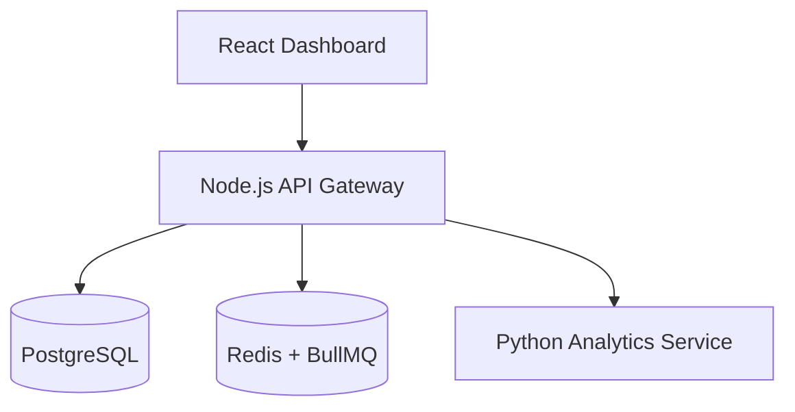
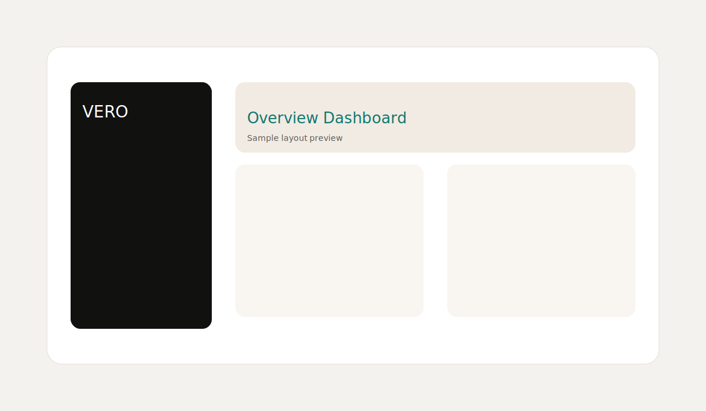
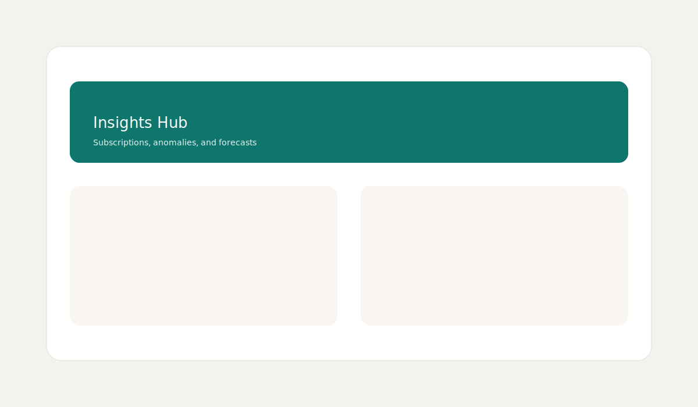

# VERO — Financial Intelligence Platform

VERO is an open-source fintech intelligence platform that simulates digital banking analytics. It ingests financial activity, classifies transactions, and produces insights about spending behavior, financial health, subscriptions, anomalies, and cashflow forecasting.

## Architecture



## Tech Stack

- Frontend: React + TypeScript + Vite
- Backend API: Node.js + Express + TypeScript
- Analytics Service: Python + FastAPI
- Database: PostgreSQL
- Caching/Queues: Redis + BullMQ
- Containerization: Docker + Docker Compose
- Testing: Jest (Node), Pytest (Python)

## Services

- `frontend`: React analytics dashboard
- `api`: Node.js API Gateway
- `analytics`: Python analytics microservice
- `postgres`: Primary data store
- `redis`: Cache and async job queue

## Setup

### Docker (recommended)

```bash
docker-compose up --build
```

Services will be available at:

- Frontend: http://localhost:5173
- API: http://localhost:4000
- Analytics: http://localhost:8000

### Local development

1. API

```bash
cd api
cp .env.example .env
npm install
npm run dev
```

2. Analytics service

```bash
cd analytics
python -m venv .venv
source .venv/bin/activate
pip install -r requirements.txt
uvicorn app.main:app --reload --port 8000
```

3. Frontend

```bash
cd frontend
cp .env.example .env
npm install
npm run dev
```

## API Documentation

### Authentication

- `POST /auth/register`
- `POST /auth/login`
- `POST /auth/refresh`

### Accounts

- `POST /accounts`
- `GET /accounts`
- `GET /accounts/:id`

### Transactions

- `POST /transactions`
- `GET /transactions`
- `GET /transactions/:id`

### Insights

- `GET /insights/subscriptions`
- `GET /insights/anomalies`
- `GET /insights/cashflow`
- `GET /insights/health`

### Dashboard

- `GET /dashboard`

#### Example request

```bash
curl -H "Authorization: Bearer <token>" http://localhost:4000/dashboard
```

#### Example response

```json
{
  "total_balance": 12450.5,
  "monthly_spending": 2210.24,
  "monthly_income": 5400,
  "top_categories": [
    { "category": "Food", "total": 320.5 },
    { "category": "Shopping", "total": 245.25 }
  ],
  "recent_transactions": []
}
```

## Screenshots




## Roadmap

- Streaming transaction ingestion
- ML-enhanced categorization
- Alerting and notifications
- Multi-currency conversions
- Advanced budgeting and goal tracking

## License

MIT
