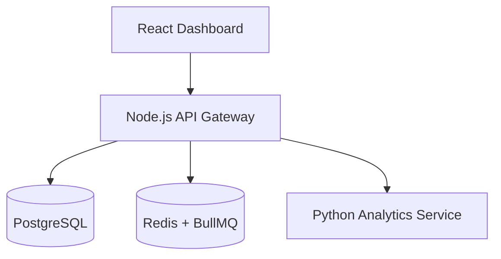

# Vero
Financial Intelligence for Smarter Decisions

## What this is

Vero is a financial intelligence platform designed to help individuals and small businesses understand, analyze, and act on their financial data with clarity.

Instead of static dashboards and disconnected tools, Vero focuses on turning raw financial data into actionable insights that support real decision-making.

## The problem

Most financial tools today fall into two buckets:

- Basic dashboards that show data but do not explain it
- Complex systems that require expertise to extract value

As a result:

- Users see numbers but lack insight
- Decisions are reactive instead of proactive
- Financial understanding remains shallow

## The approach

Vero is built around a simple idea:

Financial data should guide decisions, not just report history

The platform focuses on:

- Interpreting financial data instead of just displaying it
- Highlighting patterns, risks, and opportunities
- Providing context that helps users make informed choices

## Key features (current and planned)
- Financial data aggregation and normalization
- Insight generation based on transaction patterns
- Trend analysis for income, expenses, and cash flow
- Risk and anomaly detection
- Decision support through intelligent recommendations

## Example use cases
- Identifying spending patterns that impact savings
- Detecting irregular transactions or financial risks
- Understanding cash flow trends over time
- Supporting budgeting and planning decisions

## Demo

Coming soon

Planned:

- Interactive dashboard
- Sample datasets with generated insights
- Visual breakdowns of financial behavior

## Architecture overview

Vero is designed as a modular system with clear separation of concerns:

- Data layer: ingestion and normalization of financial data
- Processing layer: analysis and insight generation
- Application layer: APIs and business logic
- Interface layer: user-facing dashboard and visualizations

This structure allows the platform to scale from simple personal use to more complex financial scenarios.



## Design philosophy

This project is influenced by a product-first mindset:

- Clarity over complexity
- Insights over raw data
- Usability over feature bloat

Every feature is evaluated based on one question:

Does this help the user make a better financial decision?

## Current status

This project is in active development.

What exists:

- Initial project structure
- Core concept and architecture direction

What is in progress:

- First working data pipeline
- Initial insight generation logic

What is next:

- A minimal but functional dashboard
- Real data examples and outputs

## What I would improve next

- Refine the scope toward a specific user segment
- Validate assumptions with real-world financial data
- Improve the UX layer to better communicate insights

## Tech direction

Planned stack includes:

- Backend: data processing and APIs
- Frontend: interactive UI for insights and visualization
- Data layer: structured financial datasets

Details will evolve as the project matures.

## Why this project exists

Vero is an exploration of how financial tools can move beyond reporting and toward true intelligence.

The goal is not just to build another dashboard, but to create a system that helps people understand their financial reality and act on it with confidence.

## Tech Stack

- Frontend: React + TypeScript + Vite
- Backend API: Node.js + Express + TypeScript
- Analytics Service: Python + FastAPI
- Database: PostgreSQL
- Caching/Queues: Redis + BullMQ
- Containerization: Docker + Docker Compose
- Testing: Jest (Node), Pytest (Python)

## Services

- `frontend`: React analytics dashboard
- `api`: Node.js API Gateway
- `analytics`: Python analytics microservice
- `postgres`: Primary data store
- `redis`: Cache and async job queue

## Setup

### Docker (recommended)

```bash
docker-compose up --build
```

Services will be available at:

- Frontend: http://localhost:5173
- API: http://localhost:4000
- Analytics: http://localhost:8000

### Local development

1. API

```bash
cd api
cp .env.example .env
npm install
npm run dev
```

2. Analytics service

```bash
cd analytics
python -m venv .venv
source .venv/bin/activate
pip install -r requirements.txt
uvicorn app.main:app --reload --port 8000
```

3. Frontend

```bash
cd frontend
cp .env.example .env
npm install
npm run dev
```

## API Documentation

### Authentication

- `POST /auth/register`
- `POST /auth/login`
- `POST /auth/refresh`

### Accounts

- `POST /accounts`
- `GET /accounts`
- `GET /accounts/:id`

### Transactions

- `POST /transactions`
- `GET /transactions`
- `GET /transactions/:id`

### Insights

- `GET /insights/subscriptions`
- `GET /insights/anomalies`
- `GET /insights/cashflow`
- `GET /insights/health`

### Dashboard

- `GET /dashboard`

#### Example request

```bash
curl -H "Authorization: Bearer <token>" http://localhost:4000/dashboard
```

#### Example response

```json
{
  "total_balance": 12450.5,
  "monthly_spending": 2210.24,
  "monthly_income": 5400,
  "top_categories": [
    { "category": "Food", "total": 320.5 },
    { "category": "Shopping", "total": 245.25 }
  ],
  "recent_transactions": []
}
```

## Screenshots


## Roadmap

- Streaming transaction ingestion
- ML-enhanced categorization
- Alerting and notifications
- Multi-currency conversions
- Advanced budgeting and goal tracking

## License

MIT
